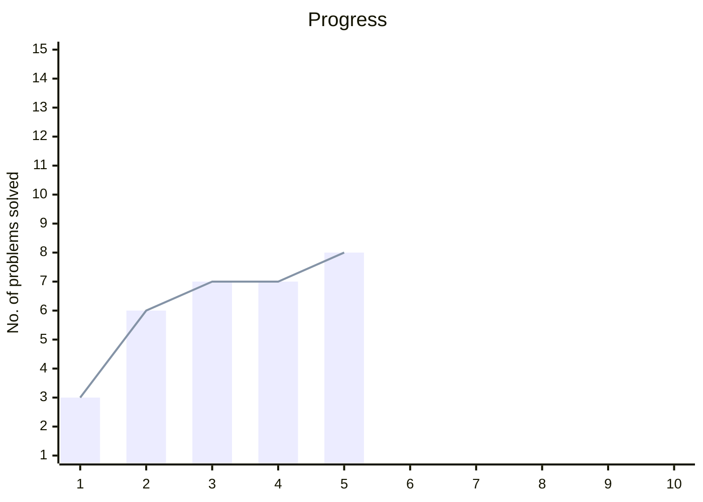

# neetcode-150
My notes for neetcode 150 dsa sheet

### Chart
|Date|day count|no. of problems|total|
|-|-|-|-|
|19-01-2026|1|3|3|
|20-01-2026|2|3|6|
|21-01-2026|3|1|7|
|22-01-2026|4|0|7|
|23-01-2026|5|1|8|

### Activity graph

### Problems checklist
> "✅" are clickable, redirecting to that problem's solution doc

|Section|1|2|3|4|5|6|7|8|9|
|-|-|-|-|-|-|-|-|-|-|
|Array|[✅](./arrays/contains-duplicate.md)|[✅](./arrays/valid-anagram.md)|[✅](./arrays/two-sum.md)|[✅](./arrays/group-anagrams.md)|[✅](./arrays/top-k-frequent-elements.md)|[✅](./arrays/encode-and-decode-strings.md)|[✅](./arrays/product-of-array-except-self.md)|[✅](./arrays/valid-sudoku.md)|_|

# Leetcode stats

