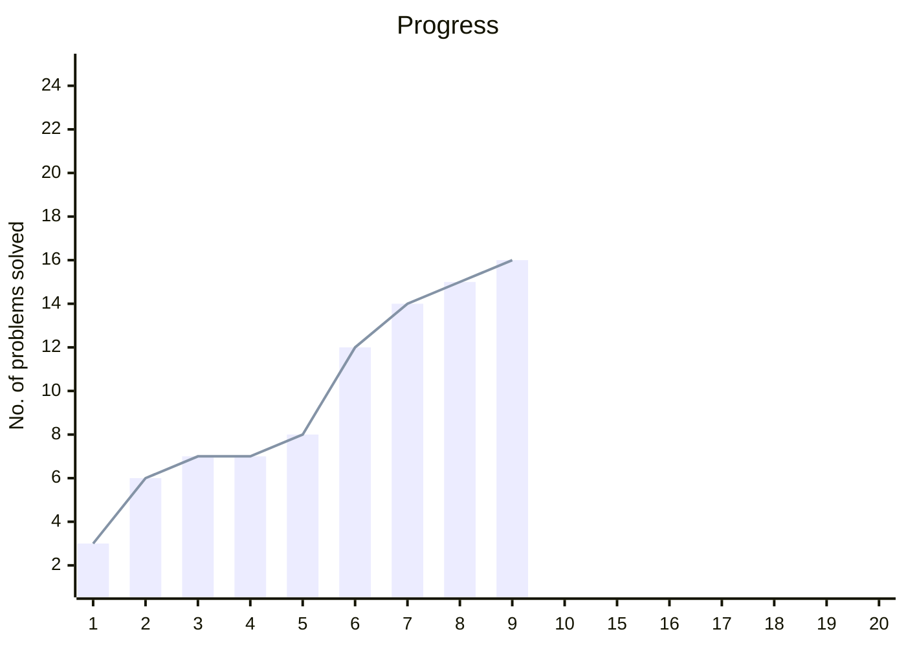

# neetcode-150
My notes for neetcode 150 dsa sheet

### Chart
|Date|day count|no. of problems|total|
|-|-|-|-|
|19-01-2026|1|3|3|
|20-01-2026|2|3|6|
|21-01-2026|3|1|7|
|22-01-2026|4|0|7|
|23-01-2026|5|1|8|
|24-01-2026|6|4|12|
|25-01-2026|7|2|14|
|26-01-2026|8|1|15|
|27-01-2026|9|1|16|

### Activity graph

### Problems checklist
> "✅" are clickable, redirecting to that problem's solution doc

> Section topic is clickable, redirecting to `toolkit` doc for that section

|Section|1|2|3|4|5|6|7|8|9|
|-|-|-|-|-|-|-|-|-|-|
|[Array](./arrays/toolkit.md)|[✅](./arrays/contains-duplicate.md)|[✅](./arrays/valid-anagram.md)|[✅](./arrays/two-sum.md)|[✅](./arrays/group-anagrams.md)|[✅](./arrays/top-k-frequent-elements.md)|[✅](./arrays/encode-and-decode-strings.md)|[✅](./arrays/product-of-array-except-self.md)|[✅](./arrays/valid-sudoku.md)|[✅](./arrays//longest-consecutive-sequence.md)|

|Section|1|2|3|4|5|
|-|-|-|-|-|-|
|[Two Pointers](./two-pointers/toolkit.md)|[✅](./two-pointers/valid-palindrome.md)|[✅](./two-pointers/two-sum-II.md)|[✅](./two-pointers/3-sum.md)|[✅](./two-pointers/container-with-most-water.md)|[✅](./two-pointers/trapping-rain-water.md)|

|Section|1|2|3|4|5|6|
|-|-|-|-|-|-|-|
|Sliding Window|[✅](./sliding-window/best-time-to-buy-and-sell-stocks.md)|[✅](./sliding-window/longest-substring-without-repeating-characters.md)|_|_|_|_|

# Leetcode stats

